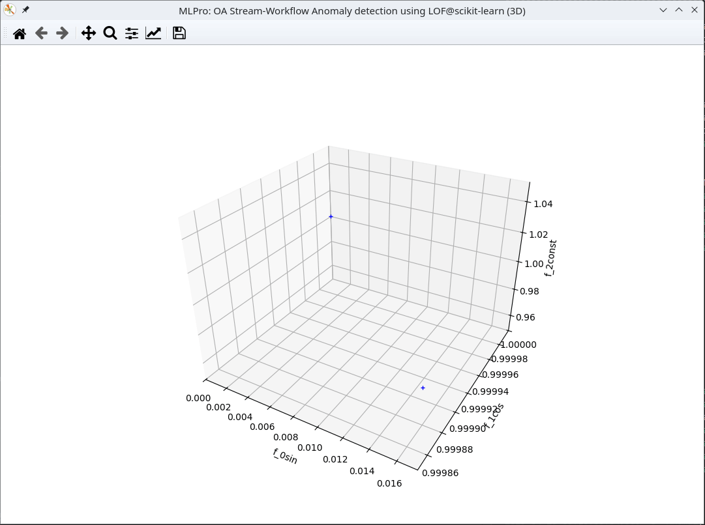

# Paper ScienceDirect MLWA - Arend e.a. - "MLPro 2.0 - Online machine learning in Python"
This repository provides the example programs described in Section _**6. MLPro-OA in practice**_ of the above journal paper.

## Preparation

[Install these Python packages](requirements.txt)

Note for running an example from this repository: After the program starts, some parameters for the experiment are requested. The results presented in the paper are achieved with the default values, which can be confirmed simply by pressing \[ENTER\]. The workflow task windows then appear. These must be manually arranged on the screen once. The positions and sizes of the windows are noted and restored the next time the program is started. After confirming the window positions with \[ENTER\], the experiment begins.

## Example 1: Extensive preprocessing

[Execute the sample program and follow the hints on the screen](example1/example1_extensive_preprocessing.py)

## Example 2a: Online clustering

[Execute the sample program and follow the hints on the screen](example2/example2a_online_clustering_of_stream_data_2d.py)

## Example 2b: Online clustering (3D)

[Execute the sample program and follow the hints on the screen](example2/example2b_online_clustering_of_stream_data_3d.py)

## Example 3a: Anomaly detection (3D)

[Execute the sample program and follow the hints on the screen](example3/example3a_anomaly_detection_3d.py)

## Example 3b: Anomaly detection (ND)

[Execute the sample program and follow the hints on the screen](example3/example3b_anomaly_detection_nd.py)

## See also

[ScienceDirect - Machine Learning with Applications](https://www.sciencedirect.com/journal/machine-learning-with-applications)

[MLPro - the integrative middleware framework for standardized machine learning in Python](https://mlpro.readthedocs.io/)

[South Westphalia University of Applied Sciences, Dept. of Automation Technology and Learning Systems](https://www.fh-swf.de/de/forschung___transfer_4/labore_3/labs/labor_fuer_automatisierungstechnik__soest_1/standardseite_57.php)

## Authors

Detlef Arend: [email](mailto:arend.detlef@fh-swf.de) | [orcid](https://orcid.org/0000-0002-8315-2346) | [researchgate](https://www.researchgate.net/profile/Detlef-Arend) | [linkedin](https://www.linkedin.com/in/detlef-arend-65170527b)

Laxmikant Shrikant Baheti: [email](mailto:baheti.laxmikantshrikant@fh-swf.de) | [orcid](https://orcid.org/0009-0001-6566-1454) | [researchgate](https://www.researchgate.net/profile/Laxmikant-Baheti) | [linkedin](https://www.linkedin.com/in/laxmikant-baheti) 

Steve Yuwono: [email](mailto:yuwono.steve@fh-swf.de) | [orcid](https://orcid.org/0000-0001-7570-2726) | [researchgate](https://www.researchgate.net/profile/Steve-Yuwono)

Syamraj Purushamparambil Satheesh Kumar: [email](mailto:syam.ps1804@gmail.com)

Andreas Schwung: [email](mailto:schwung.andreas@fh-swf.de) | [orcid](https://orcid.org/0000-0001-8405-0977) | [researchgate](https://www.researchgate.net/profile/Andreas-Schwung)
